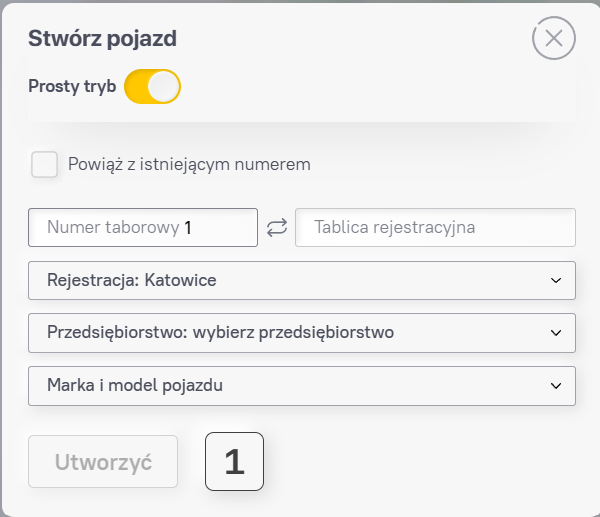
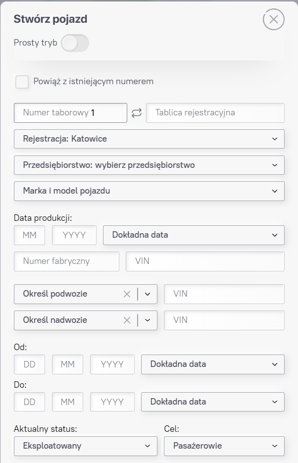
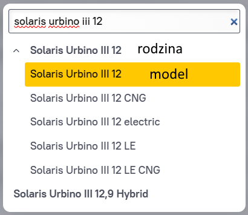

# Zasady i porady dotyczące taboru

Tworząc nową jednostkę taboru można wybrać jeden z dwóch rodzajów prezentacji formularzy: uproszczony (standardowy) i pełny.

Podczas dodawania zdjęcia korzystanie z pełnego formularza do tworzenia jest mile widziane, ale nie wymagane.
Oficjalne, dodawanie szczegółów do bazy danych jest zadaniem redaktorów. Jedynym problemem jest ich ograniczona liczba i czas.

**Uwaga!** W większości przypadków wprowadź stałą tablicę rejestracyjną w polu tablicy rejestracyjnej.

*Zobacz także: [Info o tablicach w pole "Funkcje, historia, notatki"](#funkcje-historia-notatki)*

## Model

Przy wyborze modelu pojazdu prosimy o zwrócenie uwagi na to, którą pozycję wybieramy z listy, ponieważ czasami nazwy rodzin modeli pokrywają się z nazwami samych modeli.

Nazwy rodziny modeli należy używać tylko wtedy, gdy nie znasz dokładnej modyfikacji lub gdy ta modyfikacja nie istnieje w bazie danych.

## Zajezdnia

*Zobacz także: [Miejsce rejestracji i oddziały](../Przedsi%C4%99biorstwa/Readme.md#Miejsce-rejestracji-i-oddziały)*

W przeciwieństwie do Phototransu, nasze pojazdy są przypisane do działającej bazy, a nie do prawnego właściciela.

Związanie ze spółką-matką następuje, gdy:
- firma posiada jedną zajezdnie (nie dotyczy firm zarejestrowanych w innym miejscu niż zajezdnia)
- nie wiesz na pewno, do której zajezdni należy ten pojazd (w większości przypadków ma to znaczenie, gdy w tym samym mieście jest kilka zajezdni jednego przedsiębiorstwa).

Nie wskazujemy w ewidencji pośrednich właścicieli tymczasowych (sprzedawcy, instytucje finansowe, bazy złomu).

### Przekazania między oddziałami

*Zobacz także: [Jak ustalać transfery między oddziałami](../Zrdo%C5%82a_informacji.md#jak-ustalac-transfery-miedzy-oddziałami)*

*Zobacz także: [Zmiana statusu](./Status_taboru.md#zmiana-statusu)*

W idealnej sytuacji wszystkie transfery pomiędzy oddziałami/zajezdniami/przedsiębiorstwami powinny być wprowadzane do bazy danych.

Jednak w rzeczywistości rozumiemy, że nie zawsze jest to konieczne i możliwe. W związku z tym postanowiono stworzyć próg czasu przebywania pojazdu w oddziałe/zakładzie – co najmniej 1 miesiąc.
Oczywiście nie jest zabronione dodawanie całej historii bez wyjątku w postaci osobnych rekordów profilu, ale zaleca się uwzględnienie ustalonego progu ujednolicenia bazy na terenie całego kraju, a także unikanie profili z dziesiątkami rekordów (np. w przypadku testowców).

Aby nie stracić informacji o krótkim pobycie transportu w jakimś przedsiębiorstwie, w profilu znajduje się pole [Funkcje, historia, notatki](#funkcje-historia-notatki)

## Numer fabryczny, VIN i fabryki

Wszystkie informacje o kodach VIN, fabrykach i numerach fabrycznych znajdują się w osobnym [pliku](./VINs_producers_etc.md).

## Daty "Od" i "Do"

Dla każdej daty wybieramy najdokładniejszą, zaczynając od pełnej daty (dzień/miesiąc/rok) i przeglądając poniższe listy od góry do dołu. Jeśli nie ma dokładnej daty - wykonujemy ten sam zabieg, ale bez dnia (tylko miesiąc/rok). Jeśli nie ma - to samo, tylko z samym rokiem.

### Od

Tutaj wpisujemy datę:
- przeniesienie transportu do przedsiębiorstwa (poprzez odpowiednie zlecenie/akt przyjęcia-przekazania), lub w przypadku braku:
- rejestracji państwowej/dostawy (co było później), lub:
- oddania do eksploatacji (odpowiedni dokument), albo:
- pierwszego pojawienia się na linii

### Do

Tutaj wpisujemy datę:
- wykreślenie transportu z przedsiębiorstwa (odpowiednim aktem), lub w przypadku braku:
- wykreślenia z rejestracji państwowej lub:
- wywieźenia pojazdu z terenu firmy na złom, lub:
- jego faktycznego złomowania na złomowisku, lub
- ostatniego pojawienia się na linii

## Status pojazdu

Wszystkie informacje o statusie znajdują się w oddzielnym [pliku](./Status_taboru.md).

## Notatka

Pole zostało utworzone w celu podania informacji, których nie ma na stronie.

Np. w przypadku braku określonego miasta, gminy lub przedsiębiorstwa, wpis można powiązać z „Inne” odpowiedniego województwa lub miasta i w tym polu wskazać nazwę tego miasta wraz z skróconą nazwą przedsiębiorstwa, do którego należy ten pojazd.

Lub w przypadku braku wymaganego modelu możesz wybrać rodzinę modeli (jeśli jest dostępna) lub w ogóle jej nie określać i wpisać poprawną nazwę w notatce.

Jeśli wszystkie niezbędne informacje nie mieszczą się w tym polu, to można je skrócić (na tyle, aby inni mogli to zrozumieć), a resztę wpisać w polu [„Ukryty komentarz”](#ukryty-komentarz).

**Ważne!** Proszę nie używać tego pola w innych przypadkach.

## Funkcje, historia, notatki

*Zobacz także: [Zmiana statusu](./Status_taboru.md#zmiana-statusu)*

To pole jest przeznaczone przede wszystkim do wyświetlania momentów historii, które nie są wyświetlane jako osobne wpisy profilu zgodnie z zasadami serwisu lub opisanych w tym Repo.

Pierwszym przykładem może być informacja o tymczasowych/tranzytowych/dealerskich tablicach rejestracyjnych, jeśli nie były one używane do pracy liniowej dłużej niż 1 miesiąc (we wszystkich przedsiębiorstwach łącznie).

Innym przykładem może być historia transferów transportowych:
- między przedsiębiorstwami, w których przebywał krócej niż miesiąc (np. „wycieczki” egzemplarzów testowych po kraju).
- historia z innych regionów/krajów, w których redaktor nie ma uprawnień do dodawania wpisów.

Kolejnym przykładem są statystyki transportowe. Więcej na ten temat można przeczytać w [tym](./Status_taboru.md) pliku.

W tym polu można również wpisać inne opcjonalne informacje, takie jak kolor autobusu, jego status prawny (prawdziwy właściciel (bank itp.)), informacje statystyczne (np. "12. zmodernizowany tramwaj tego typu w zajezdni Lipiny") itp. Ważne jest, aby trzymać się ram zdrowego rozsądku i czystości tego pola, aw niektórych przypadkach powstrzymać się od dodawania pewnych niezbyt ważnych informacji.

## Ukryty komentarz

W tym polu możesz wpisać informacje, które zobaczą tylko redaktorzy.