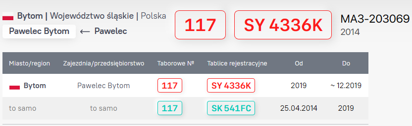
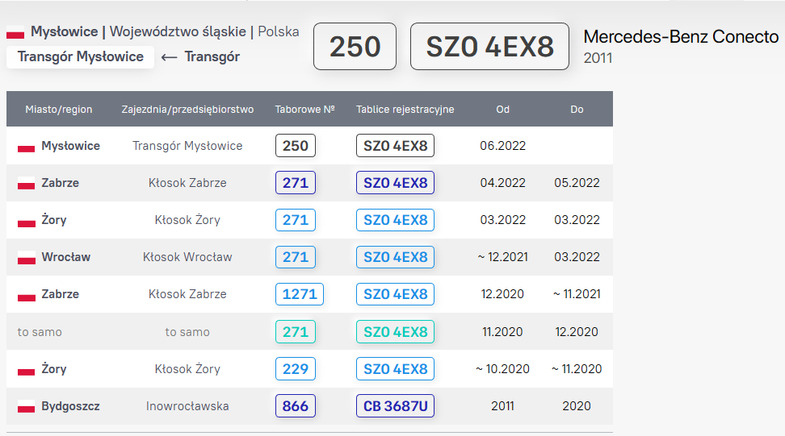
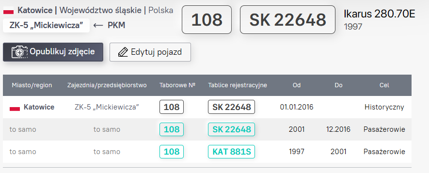
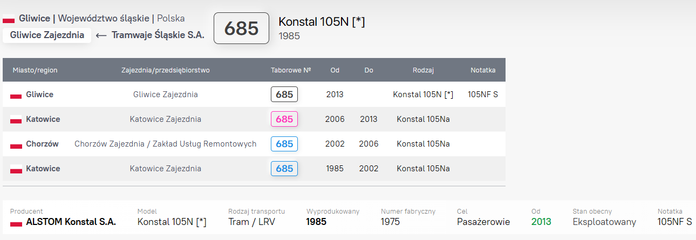
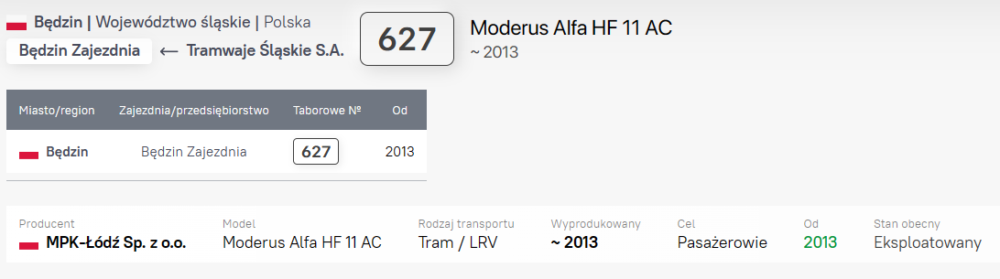

# Status taboru

## Stan

- Nowy - transport jest nowy i nigdy nie był używany przez żadne przedsiębiorstwo (zwykle dotyczy nowego sprzętu, który nie był jeszcze na linii)

- Nieużywany w tym przedsiębiorstwie – używany pojazd, który został przeniesiony z innego działu/przedsiębiorstwa i który jeszcze nie był eksploatowany w tym przedsiębiorstwie

- Nie eksploatowany – transport, który aktualnie nie jest używany, najczęściej z powodu awarii

- Wycofany z eksploatacji - jednostka transportowa, która nie będzie już (jej wykorzystanie nie jest planowane) w eksploatacji w tym przedsiębiorstwie

- Skasowany - jeśli historia pojazdu zakończyła się obecnie w tym przedsiębiorstwie lub jeśli został zezłomowany

- Zniknął - kiedy wiemy na pewno, że zniknął (nieważne jak dziwnie to brzmi😅)

- Modernizacja/zmiana modelu (**WAŻNE!!!** - czytaj: [Modernizacje i profile pojazdów](#modernizacje-i-profile-pojazdów))

- Zmiana miasta lub przedsiębiorstwa - w przypadku przeniesienia pojazdu do innej firmy (ze zmianą miasta lub bez)

- Przekazany w ramach przedsiębiorstwa - transfer z jednej zajezdni (oddziału) do drugiej jednego i tego samego przedsiębiorstwa

- Zmiana danych w ramach oddziału – np. zmiana numeracji w ramach zajezdni, czy zmiana przeznaczenia pojazdu (np. przeróbka na służbowy lub historyczny)

- Nie wiadomo – gdy nie mogłeś znaleźć w Internecie informacji o aktualnym stanie transportu (np. jeśli zdjęcie zostało zrobione w innym kraju o jakim istnieje bardzo niewiele zasobów i źródeł informacji)

- Skradziony - przypadku, gdy pojazd nie zniknął tak po prostu, ale wiadomo o jego kradzieży (na przykład zostało złożone zawiadomienie na policji lub oświadczenie osoby uprawnionej o tym zostało utrwalone w mediach).

Jeżeli w wyniku agresji militarnej flota znajdzie się pod okupacją, możliwe są następujące opcje:

- Wiadomo, że jest oświadczenie o kradzieży floty - używany jest status "Skradziony".
- Nie ma roszczenia o kradzież floty, a jej lokalizacja nie uległa zmianie - używany jest aktualny stan („Eksploatowany”, „Nie eksploatowany”, „Wycofany z eksploatacji” itp.).
- Nie ma stwierdzenia kradzieży, ale bez działań prawnego właściciela zmieniło się położenie taboru (np. okupanci wywieźli go do innego miasta lub oddali na złom) - „Skradziono”.
- Nie ma zgłoszenia o kradzieży, a lokalizacja się zmieniła, ale nie wiadomo gdzie - "Zniknął".

## Ceł

- Pasażerski - używany w pracy liniowej na stałe.

- Serwisowy - np. techniczny lub transport pracowników firmy/huty

- Historyczny - transport zabytkowy

- Edukacyjny - nauka jazdy

- Testowy

- Inny

## Zmiana statusu

### Bez tworzenia osobnego wpisu

Zmieniamy następujące stany transportu dla bieżącego rekordu profilu, czyli NIE tworzymy nowego:

- "Nowy" i zmiana go na inne statusy na tej liście
- "Nieużywany w tym przedsiębiorstwie" i zmiana go na inne statusy na tej liście
- "Nie eksploatowany" i zmiana go na inne statusy na tej liście
- "Wycofany z eksploatacji" i zmiana go na inne statusy na tej liście
- "Skasowany" i zmiana go na inne statusy na tej liście
- "Zniknął" i zmiana go na inne statusy na tej liście
- "Nie wiadomo" i zmiana go na inne statusy na tej liście
- "Skradziony" i zmiana go na inne statusy na tej liście
- "Eksploatowany" i zmiana go na inne statusy na tej liście

Dla następujących stanów datę uzyskania tego statusu zapisujemy w dacie końcowej:
- "Wycofany z eksploatacji"
- "Skasowany"
- "Skradziony"

W innych przypadkach (np. okresy kiedy transport nie działał z przyczyn technicznych) możesz określić w polu [Funkcje, historia, notatki](./Readme.md#funkcje-historia-notatki)

### Z tworzeniem osobnego wpisu

Tworzymy nowy rekord profilu w przypadku zmiany stanu na:

- ["Modernizacja/zmiana modelu"](#modernizacje-i-profile-taborowe)
- "Zmiana miasta lub przedsiębiorstwa"
- "Przekazany w ramach przedsiębiorstwa"
- "Zmiana danych w ramach oddziału"
- zmiana przeznaczenia transportu ("[Celu](#ceł)" transportu)

Weźmy na przykład tego Mercedesa z „bogatą” historią:
- początkowo pracował w zajezdni autobusowej bydgoskiego MPK
- następnie został przeniesiony do innej firmy (Kłosok) - powstał nowy rekord w żorowskiej zajezdni Kłoska; bydgoski wpis zmienił kolor na granatowy (Zmiana miasta lub przedsiębiorstwa)
- po tym Kołosok przestawił ten samochód do zabrzańskiej zajezdni (w Zabrzu powstał nowy rekord) a żorowski rekord zmienił kolor na niebieski (Przekazany w ramach przedsiębiorstwa)
- w czasie pobytu autobusu w Zabrzu on zmienił swój numer, tj. został przenumerowany w ramach oddziału (Zmiana danych w ramach oddziału); rekord ze starym numerem zmienił kolor na turkusowy i powstał nowy rekord z nowym numerem
- itd...

Powyższy przykład pokazuje zmianu przeznaczenia autobusa.
Ten Ikarus z numerem bocznym #108 był zwykłym autobusem pasażerskim do 2016 roku.
Następnie został przeniesiony do kategorii zabytkowego/historycznego, czyli wpis z przeznaczeniem pasażerskiem stał turkusowym (bo autobus nie zmieniał zajezdni) i powstał nowy rekord o przeznaczeniu historycznym.

### Modernizacje i profile taborowe

Modernizacja pojazdu jest wyświetlana na stronie internetowej tylko wtedy, gdy zachowana jest oryginalna numerowana część pojazdu (na przykład rama lub nadwozie). Przykład:

W przypadku wymiany częśći numerowanej należy utworzyć nowy <ins>**PROFIL**</ins>, czyli odrębną jednostkę transportową. Wtedy dla ostatniego wpisu starego profilu tego samochodu należy wskazać odpowiedni stan określonej częśći numerowanej (na przykład stan starego nadwozia) - "Skasowany", "Niewiadomo" itp.

Na przykład ten Konstal nie jest przywiązany do żadnego starego profilu, ponieważ jest wykonany na bazie zupełnie nowego pudła:

